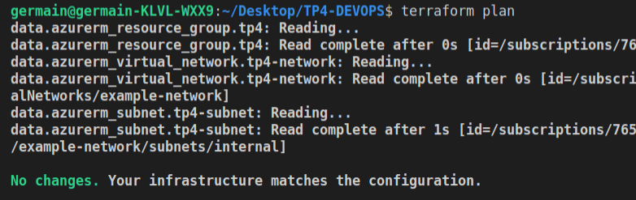

# TP4 
---
## On se connecte à azure et on accède au ressource group
---
On initalise
```
terraform init
```
.


On se connecte à azure
```
az login
```


On accède ensuite au ressource group puis au reseau et au sous-réseau :
```
data "azurerm_resource_group" "tp4"  {
  name = "devops-TP2"
}

data "azurerm_virtual_network" "tp4-network" {
    name = "example-network"
    resource_group_name = data.azurerm_resource_group.tp4.name
}

data "azurerm_subnet" "tp4-subnet" {
    name = "internal"
    resource_group_name = data.azurerm_resource_group.tp4.name
    virtual_network_name = data.azurerm_virtual_network.tp4-network.name
}

```


On vérifie le tout :
```
terraform plan
```



---
## On créer la VM sur azure
---
On choisi le type d'accès à la VM (ici SSH)
```
resource "azurerm_network_security_group" "myterraformnsg" {
  name                = "myNetworkSecurityGroup-20180604"
  location            = data.azurerm_resource_group.tp4.location
  resource_group_name = data.azurerm_resource_group.tp4.name

  security_rule {
    name                       = "SSH"
    priority                   = 1001
    direction                  = "Inbound"
    access                     = "Allow"
    protocol                   = "Tcp"
    source_port_range          = "*"
    destination_port_range     = "22"
    source_address_prefix      = "*"
    destination_address_prefix = "*"
  }
}
```
on configure le fait d'accèder à notre VM via une addresse IP publique
```
resource "azurerm_network_interface" "tp4-nic" {
  name                = "tp4-nic"
  location            = data.azurerm_resource_group.tp4.location
  resource_group_name = data.azurerm_resource_group.tp4.name

  ip_configuration {
    name                          = "internal"
    subnet_id                     = data.azurerm_subnet.tp4-subnet.id
    private_ip_address_allocation = "Dynamic"
    public_ip_address_id          = azurerm_public_ip.tp4-public-ip.id
  }
}
```


On créer la clef RSA permettant de se connecter à la VM
```
resource "tls_private_key" "tp4-prkey" {
  algorithm = "RSA"
  rsa_bits  = 4096
}
```
Puis on enregistre la clef dans un fichier
```
terraform output -raw tls_private_key > id_rsa
```

On configure la VM:
```
resource "azurerm_linux_virtual_machine" "devops-20180604" {
  name                            = "devops-20180604"
  resource_group_name             = data.azurerm_resource_group.tp4.name
  location                        = data.azurerm_resource_group.tp4.location
  size                            = "Standard_D2s_v3"
  admin_username                  = "devops"
  disable_password_authentication = true
  network_interface_ids = [
    azurerm_network_interface.tp4-nic.id,
  ]

  admin_ssh_key {
    username   = "devops"
    public_key = tls_private_key.tp4-prkey.public_key_openssh
  }

  os_disk {
    caching              = "ReadWrite"
    storage_account_type = "Standard_LRS"
  }

  source_image_reference {
    publisher = "Canonical"
    offer     = "UbuntuServer"
    sku       = "16.04-LTS"
    version   = "latest"
  }
}

```
----
## déploiement et test d'accès
----
On déploie la VM 
```
terraform apply
```


On peut constater la bonne création de la Vm directement sur azure dans le ressource group:


Puis on se connecte à la VM:

```
ssh -i id_rsa devops@XX.XXX.XX.XXX cat /etc/os-release
```

On obtient une erreur car on ne peut pas utiliser la clef :


On utilise la commande suivante pour regler le problème :
```
sudo chmod 600 fichier_clef
```
On réitère l'étape précédente et on obtient:


On arrive donc bien à se connecter à la VM.

On supprime ensuite la VM avec :
```
terraform destroy
```
.


